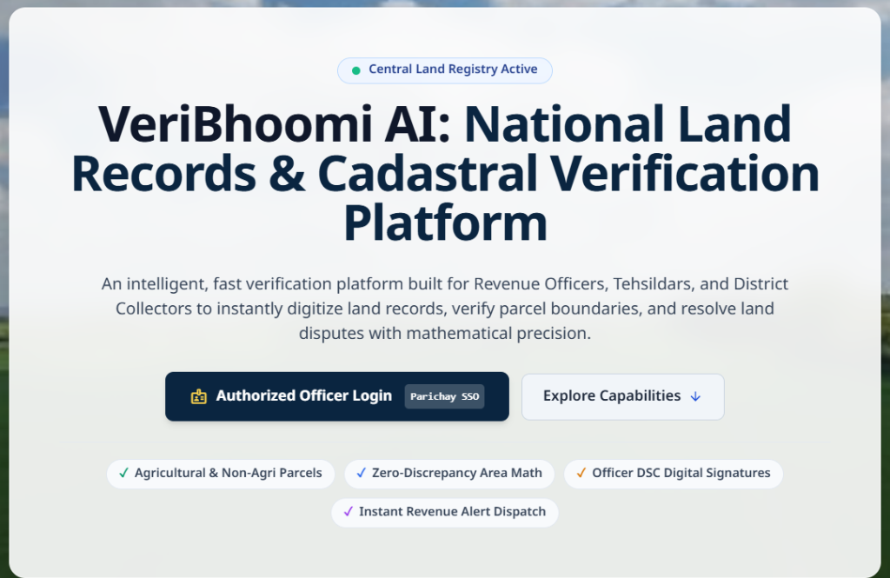
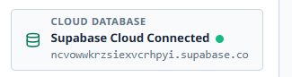
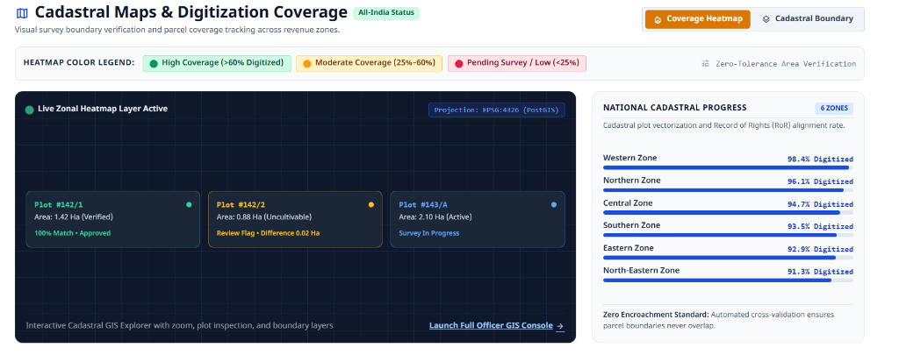
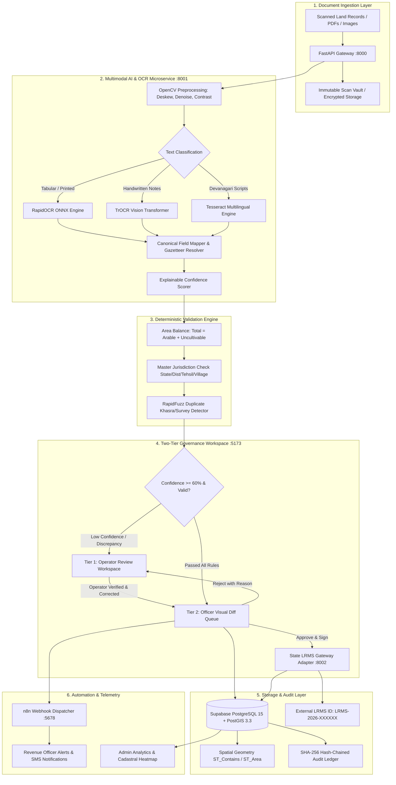

# VeriBhoomi AI: National Cadastral & Land Records Verification Platform

[](https://python.org)
[](https://fastapi.tiangolo.com)
[](https://react.dev)
[](https://vitejs.dev)
[](https://tailwindcss.com)
[](https://www.postgresql.org)
[](https://www.docker.com)
[](LICENSE)

> **Empowering National Land Governance with Explainable AI & Human-in-the-Loop Verification**
> 
> *VeriBhoomi AI* is a sovereign, enterprise-grade land record digitization, mathematical verification, and cadastral spatial validation platform. Engineered for revenue departments and land management administrations, it bridges scanned legacy records (Record of Rights, Jamabandi, Form 7/12, Mutation registers) and modern state Land Record Management Systems (LRMS) through multimodal AI, zero-tolerance deterministic math balancing, two-tier human governance, and cryptographic auditability.

---

## Screenshots

### 1. Sovereign Unified Access Portal
*Featuring authentic liquid glassmorphism, instant trilingual switching (English, Hindi, Marathi), and role-based access for Operators, Revenue Officers, and Administrators.*



---

### 2. High-Precision Document Review & Loupe Inspection
*Synchronized 55/45 split workspace with deep-zoom pan/rotate scan viewer, OCR bounding box detection, and field-by-field verification with explainable confidence scoring.*



---

### 3. Cadastral GIS & Village Digitization Heatmap
*Spatial parcel boundaries powered by PostGIS, parcel-level telemetry, and village coverage heatmaps with prominent status legends.*



---

## Key Features

- **Multimodal AI Vision & Hybrid OCR Pipeline**:
  - **RapidOCR**: Ultra-fast ONNX runtime engine for printed tabular land records and revenue registers.
  - **TrOCR (Transformer OCR)**: Deep learning VisionEncoderDecoder model for challenging handwritten marginal annotations, mutation remarks, and signatures.
  - **Tesseract OCR**: Robust Devanagari and multilingual script extraction (Hindi, Marathi, English) with automatic DPI normalization and Otsu binarization.
- **Zero-Tolerance Area Math Balancing**:
  - Enforces strict mathematical equilibrium: $\text{Total Land Area} = \text{Cultivable (Arable) Area} + \text{Uncultivable (Pot Kharaba) Area}$.
  - Blocks submission and highlights discrepancies whenever parcel component subdivisions do not reconcile to zero decimal tolerance.
- **Explainable Confidence Scoring & Anomaly Detection**:
  - Every extracted property carries a transparent 0–100% confidence metric derived from OCR token probabilities and gazetteer dictionary matching.
  - Automatic flagging of sub-threshold fields (<60%) requiring mandatory human review.
- **Two-Tier Human-in-the-Loop (HITL) Governance**:
  - **Tier 1 (Operator)**: High-throughput review workspace featuring synchronized 55/45 split layout, rotation, contrast enhancement, and one-click field corrections.
  - **Tier 2 (Revenue Officer)**: Visual diff review queue displaying side-by-side strike-throughs of AI draft values versus operator corrections, complete with one-click approval or rejection with reason.
- **Cadastral GIS Spatial Integration**:
  - Native PostGIS geospatial indexing (`ST_Contains`, `ST_Area`, `ST_Centroid`) for village boundaries and cadastral survey plots.
  - Dynamic digitization heatmaps displaying coverage density, parcel classifications, and disputed boundary boundaries.
- **Cryptographic Hash-Chained Audit Trail**:
  - Immutable SHA-256 chained ledger recording all actions (`BATCH_CREATED`, `FIELD_CORRECTED`, `OFFICER_APPROVED`, `PUSHED_TO_LRMS`).
  - Ensures non-repudiation, tamper detection, and complete compliance with national evidentiary standards.
- **Automated n8n Webhook Dispatch**:
  - Event-driven notifications dispatched to n8n workflow pipelines for instant email alerts, revenue officer notifications, and external microservice triggers.

---

## System Architecture



---

## TechStack

| Component | Technology | Version | Purpose |
|---|---|---|---|
| **Frontend Framework** | React + TypeScript | `18.3+` | High-performance, type-safe enterprise client application |
| **Bundler & Tooling** | Vite | `5.4+` | Lightning-fast HMR and optimized production bundling |
| **Styling & Icons** | Tailwind CSS + Lucide Icons | `3.4+` | Sovereign design system with liquid glassmorphism UI |
| **Mapping & GIS** | Leaflet + React-Leaflet | `1.9+` | Interactive cadastral mapping and GeoJSON parcel rendering |
| **Analytics & Charts** | Recharts | `2.12+` | Real-time departmental throughput and accuracy analytics |
| **Backend Framework** | FastAPI (Python) | `0.110+` | High-throughput asynchronous REST API gateway |
| **ASGI Server** | Uvicorn | `0.28+` | Production ASGI web server |
| **Database & GIS Engine** | PostgreSQL + PostGIS | `15.0 / 3.3+` | Relational storage and spatial geometry computation |
| **ORM & Migrations** | SQLAlchemy | `2.0+` | Robust declarative data modeling and connection pooling |
| **Document OCR** | RapidOCR + ONNX Runtime | `1.3+` | High-throughput printed text and tabular extraction |
| **Handwritten OCR** | Hugging Face TrOCR | `Base` | Transformer vision model for handwritten revenue remarks |
| **Multilingual OCR** | Tesseract OCR | `5.3+` | Devanagari (Hindi, Marathi) and English script support |
| **Image Processing** | OpenCV (cv2) + Pillow | `4.9+` | Image deskewing, noise reduction, and boundary crop |
| **Workflow Automation** | n8n | `Latest` | Enterprise event-driven workflow automation |
| **Containerization** | Docker & Docker Compose | `v2+` | Isolated multi-service production orchestration |

---

## Repository Directory Structure

```
veribhoomi-ai/
├── backend/                           # FastAPI Core Enterprise Backend (:8000)
│   ├── app/
│   │   ├── adapters/                  # State LRMS adapter interface & mock connectors
│   │   ├── api/
│   │   │   └── routers/               # API endpoints (auth, batches, documents, gis, stats, audit)
│   │   ├── models/                    # SQLAlchemy models (User, Batch, Document, ExtractedField, AuditLog)
│   │   ├── schemas/                   # Pydantic validation schemas & Canonical Data Contracts
│   │   ├── services/                  # Document processing, storage, and n8n webhook services
│   │   ├── validation/                # 7-point deterministic validation engine & duplicate detection
│   │   ├── config.py                  # Environment settings & configuration loading
│   │   ├── database.py                # PostGIS / PostgreSQL connection pool & SQLite fallback
│   │   ├── dependencies.py            # RBAC enforcement, OAuth2 password flow & JWT auth
│   │   └── main.py                    # Application entrypoint & CORS middleware
│   ├── scripts/                       # Database seeding, sample scan generators & active learning
│   ├── tests/                         # Pytest test suites (auth, verification, API tests)
│   └── requirements.txt               # Backend Python dependencies
│
├── frontend/                          # React + TypeScript + Vite Client (:5173)
│   ├── src/
│   │   ├── components/                # UI components (DocumentViewer, FieldCard, DiffViewer, SpatialMap)
│   │   ├── context/                   # AuthContext with role-based navigation and token management
│   │   ├── layouts/                   # DashboardLayout & ProtectedRoute guards
│   │   ├── pages/                     # HomePage, Login, OperatorReview, OfficerQueue, AdminGIS, AdminAudit
│   │   ├── services/                  # Axios HTTP client endpoints
│   │   ├── types/                     # TypeScript definitions for Canonical Data Contracts
│   │   ├── App.tsx                    # React router definitions
│   │   └── main.tsx                   # Frontend bootstrapping
│   ├── index.html                     # HTML root with responsive viewport
│   ├── tailwind.config.js             # Sovereign theme configurations & glassmorphism utilities
│   ├── vite.config.ts                 # Vite bundler configuration & proxy settings
│   └── package.json                   # Frontend npm dependencies
│
├── ml-service/                        # AI & Vision OCR Microservice (:8001)
│   ├── app/
│   │   ├── pipeline/                  # Preprocessing, RapidOCR, TrOCR, Tesseract, Layout & Mapper
│   │   └── main.py                    # REST API endpoints for /extract and /feedback
│   └── requirements.txt               # ML & Computer Vision dependencies
│
├── mock-lrms/                         # Mock State Land Record Management System Gateway (:8002)
│   ├── main.py                        # Mock government endpoints (POST /records, GET /records/{id})
│   └── requirements.txt               # Minimal gateway dependencies
│
├── n8n/                               # Workflow Automation (:5678)
│   └── workflows/
│       └── veribhoomi_master_workflow.json # Unified webhook trigger & watchdog workflow
│
├── sample-data/                       # Sample records & Cadastral GIS Layers
│   ├── documents/                     # High-res sample scanned land records
│   ├── geojson/                       # Cadastral village polygon GeoJSON boundaries
│   └── master_reference.json          # Master revenue administrative gazetteer
│
├── docs/                              # Project documentation & visual assets
│   └── screenshots/                   # Production UI screenshots
│
├── docker-compose.yml                 # Multi-container orchestration stack
├── run_all.py                         # One-click cross-platform orchestration runner
└── README.md                          # Project documentation
```

---

## Quick Start & Installation Guide

### Prerequisites
- **Python**: Version `3.11` or `3.12`
- **Node.js**: Version `18.x` or `20.x` (with `npm`)
- **Tesseract OCR**: Installed with English and Devanagari (`hin`, `mar`) language packages
- **Docker & Docker Compose** *(Optional, for containerized execution)*

---

### Option A: One-Command Local Runner (Recommended)

The root runner script handles dependency checks, database seeding, and concurrently launches all microservices:

```bash
# Clone the repository
git clone https://github.com/rajatsurana19/veribhoomi-ai.git
cd veribhoomi-ai

# Execute the master runner
python run_all.py
```

This automatically orchestrates:
1. **Mock LRMS Gateway** $\rightarrow$ `http://localhost:8002`
2. **AI & Vision Pipeline** $\rightarrow$ `http://localhost:8001`
3. **FastAPI Core Backend** $\rightarrow$ `http://localhost:8000`
4. **React Frontend** $\rightarrow$ `http://localhost:5173`

---

### Option B: Docker Compose Deployment

To spin up the entire production container stack including **PostgreSQL + PostGIS** and **n8n Automation Engine**:

```bash
# Launch all container services
docker compose up --build -d

# View live application logs
docker compose logs -f
```

**Service Endpoints:**
- **Frontend Portal**: `http://localhost:5173`
- **FastAPI Core Backend**: `http://localhost:8000` (Interactive Docs: `http://localhost:8000/docs`)
- **AI OCR Microservice**: `http://localhost:8001`
- **Mock State LRMS**: `http://localhost:8002`
- **n8n Automation Console**: `http://localhost:5678`
- **PostgreSQL / PostGIS Database**: `localhost:5432`

---

### Option C: Manual Step-by-Step Setup

#### 1. Backend Service
```bash
cd backend
python -m venv .venv
source .venv/bin/activate  # On Windows: .venv\Scripts\activate
pip install -r requirements.txt

# Run initial database setup and seed data
python scripts/seed_data.py

# Launch FastAPI Server
uvicorn app.main:app --host 0.0.0.0 --port 8000 --reload
```

#### 2. ML & Vision Service
```bash
cd ml-service
python -m venv .venv
source .venv/bin/activate  # On Windows: .venv\Scripts\activate
pip install -r requirements.txt

# Launch Vision OCR Server
uvicorn app.main:app --host 0.0.0.0 --port 8001 --reload
```

#### 3. Frontend Web Application
```bash
cd frontend
npm install
npm run dev
```

---

### Department User Accounts (Pre-Seeded)

The login screen provides direct 1-click role selection buttons for testing and demonstration:

| Role | Email | Password | Primary Authority & Responsibilities |
|---|---|---|---|
| **Operator** | `operator@veribhoomi.gov` | `password` | Document batch intake, 55/45 split review, field correction, and officer submission |
| **Revenue Officer** | `officer@veribhoomi.gov` | `password` | Visual diff verification, validation inspection, 1-click LRMS sync, and rejection with reason |
| **Administrator** | `admin@veribhoomi.gov` | `password` | Real-time analytics, Cadastral GIS heatmap, system telemetry, and cryptographic audit log |

---

## Database Schema Summary

The VeriBhoomi AI relational and spatial schema is structured across 9 core tables:

| Table Name | Primary Key | Foreign Keys / Relationships | Core Attributes & Purpose |
|---|---|---|---|
| `users` | `id` (UUID) | Has many `batches`, `audit_logs` | Role-based accounts (`operator`, `officer`, `admin`), hashed credentials, department, and designation. |
| `batches` | `id` (UUID) | `created_by` $\to$ `users.id` | Administrative batch groupings (State, District, Tehsil, Village, total document counts, status). |
| `documents` | `id` (UUID) | `batch_id` $\to$ `batches.id`, `reviewed_by`, `approved_by` $\to$ `users.id` | Scanned land record metadata, file storage path, overall confidence score, verification status, and LRMS reference ID. |
| `extracted_fields` | `id` (UUID) | `document_id` $\to$ `documents.id`, `corrected_by` $\to$ `users.id` | Granular land record attributes (`owner_name`, `khasra_number`, `plot_area`, etc.), AI extracted values, operator corrected values, confidence scores, and source indicators (`auto` vs `corrected`). |
| `validation_results` | `id` (UUID) | `document_id` $\to$ `documents.id` | Results of deterministic rule evaluations (Area balance, gazetteer checks, duplicate detection, severity level, blocking status). |
| `audit_log` | `id` (UUID) | `user_id` $\to$ `users.id`, `document_id` $\to$ `documents.id` | Cryptographic SHA-256 hash-chained ledger (`entry_hash`, `previous_hash`, `action`, `old_value`, `new_value`, `timestamp`, `ip_address`). |
| `master_reference` | `id` (UUID) | Queried by jurisdiction combinations | Official national revenue gazetteer hierarchy (State, District, Tehsil, Village, Census code, and PostGIS spatial geometry boundaries). |
| `lrms_push_log` | `id` (UUID) | `document_id` $\to$ `documents.id`, `pushed_by` $\to$ `users.id` | Outbound transaction audit logging payloads, responses, and external IDs returned by the state LRMS gateway. |
| `notifications` | `id` (UUID) | `user_id` $\to$ `users.id` | Departmental workflow notifications, escalation alerts, redo requests, and rejection notes. |

---

## Contributors

<table> <tr> <td align="center"> <a href="https://github.com/bahuli1203">  <br /> <sub><b>Shravani</b></sub> </a> </td> <td align="center"> <a href="https://github.com/manasvi-chauhan">  <br /> <sub><b>Manasvi Chauhan</b></sub> </a> </td> <td align="center"> <a href="https://github.com/Shreya-Boda">  <br /> <sub><b>Shreya Boda</b></sub> </a> </td> <td align="center"> <a href="https://github.com/mihir-doshi-018">  <br /> <sub><b>Mihir Doshi</b></sub> </a> </td> <td align="center"> <a href="https://github.com/nishantjain11">  <br /> <sub><b>Nishant Jain</b></sub> </a> </td> <td align="center"> <a href="https://github.com/rajatsurana19">  <br /> <sub><b>Rajat Surana</b></sub> </a> </td> </tr> </table>

---

<p align="center">
  <b>VeriBhoomi AI</b> — Developed for the National Smart India Hackathon & Land Record Modernization Initiatives.
</p>
