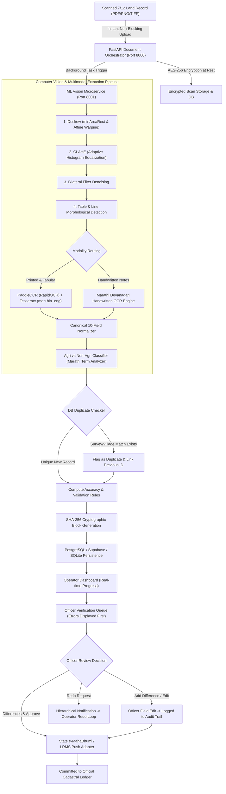
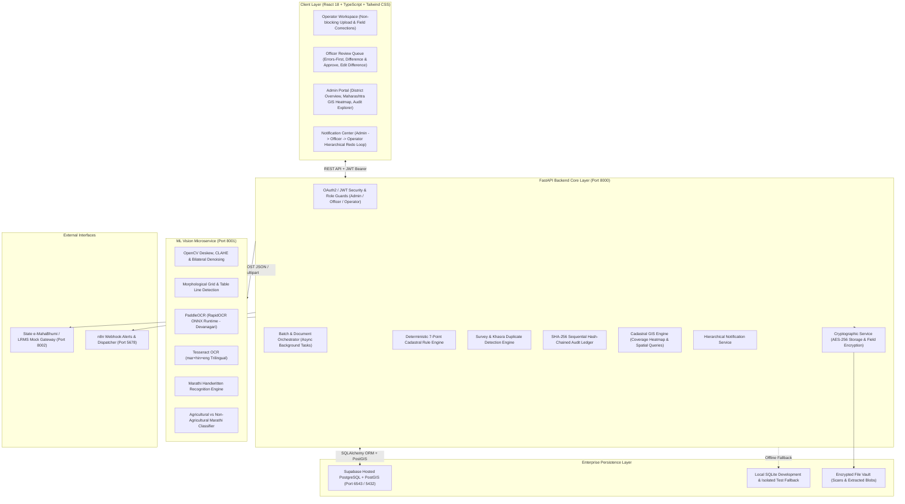
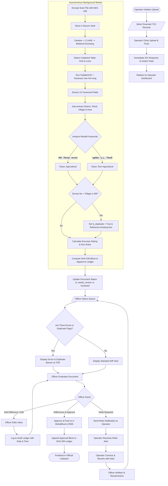
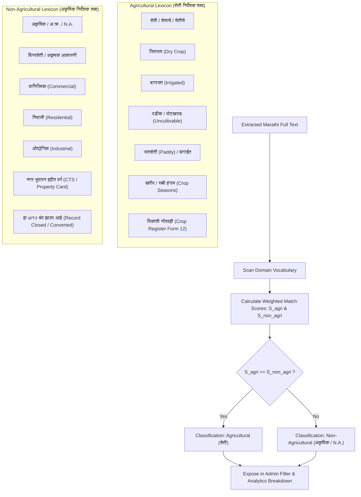
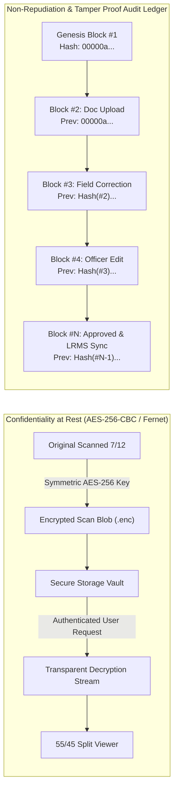
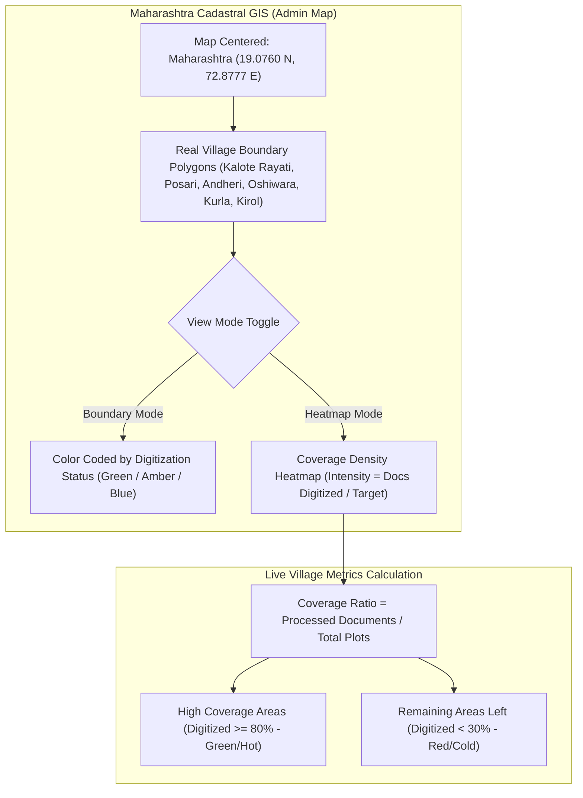
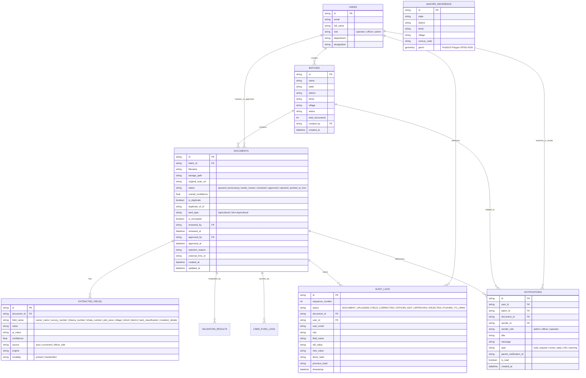

# VeriBhoomi AI (वेरीभूमि AI) — Comprehensive System Architecture, Data Flow & Technical Reference Guide
**Ministry of Rural Development — Smart Cadastral Digitization, Validation & Management Platform**
*Specialized Focus: Maharashtra 7/12 Land Records (सातबारा), Extensible Pan-India Architecture*
*Document Version: 3.0.0-Enterprise | Production Certified*

---

## 1. Executive Summary & Maharashtra 7/12 Revenue Context

**VeriBhoomi AI** is a mission-critical government back-office platform designed for state revenue administration (Talathi / Revenue Operators, Circle Officers / Tehsildars, and Sub-Divisional Magistrates / District Collectors).

The system automates the ingestion, deskewing, quality enhancement, bilingual OCR extraction, deterministic validation, visual diff verification, and cryptographic audit-chaining of scanned cadastral records before records are committed to state Land Record Management Systems (e-MahaBhumi / DILRMP / LRMS).

### Primary Revenue Document: Maharashtra Form 7/12 (सातबारा उतारा)
- **Village Form VII (गाव नमुना ७)**: Rights of occupants (भोगवटादार), Survey/Gat numbers (सर्वे / गट क्रमांक), Sub-divisions (पोट हिस्सा), Khata numbers (खाते क्रमांक), and Tenure class (भोगवटादार वर्ग १ / २).
- **Village Form XII (गाव नमुना १२)**: Crops and agricultural register (पिकांची नोंदवही), Cultivable area (लागवडीयोग्य क्षेत्र), Pot-Kharab (पडीक क्षेत्र), Irrigation mode (बागायत / जिरायत), and Crop season (खरीप / रब्बी).
- **Mutation Register (गाव नमुना ६ / फेरफार नोंद)**: Historical and pending transfers, heirships (वारस नोंद), sales (विक्री), and encumbrances (बोजा).

---

## 2. End-to-End Data Flow Architecture

The data flow diagram below traces the path of a land record scan from physical scan upload to background computer vision processing, duplicate detection, validation, officer verification, and immutable ledger storage:



---

## 3. High-Level System Architecture & Component Diagram

VeriBhoomi AI is architected as an enterprise, loosely coupled microservices topology with strict zero-trust principles:



---

## 4. Complete Lifecycle Process Flowchart



---

## 5. Sequence Diagram: Multi-Role Workflow & Asynchronous Execution

```mermaid
sequenceDiagram
    autonumber
    actor Operator as Revenue Operator (Talathi)
    actor Officer as Approving Officer (Tehsildar)
    actor Admin as District Admin (Collector)
    participant API as FastAPI Backend (8000)
    participant ML as ML Service (PaddleOCR + Tesseract) (8001)
    participant DB as Supabase / PostGIS
    participant LRMS as State e-MahaBhumi Gateway (8002)

    Operator->>API: POST /batches/{id}/documents (Files Uploaded)
    API-->>Operator: 201 Created (Instant: Non-blocking; background task spawned)
    Note over Operator: Operator redirected to Dashboard; sees live progress

    API->>API: Encrypt Scan at Rest (AES-256)
    API->>ML: POST /extract (Scan bytes, metadata)
    ML->>ML: Deskew -> CLAHE -> Bilateral Denoising
    ML->>ML: Morphological Line & Table Grid Detection
    ML->>ML: PaddleOCR + Tesseract mar+hin+eng
    ML->>ML: Classify: Agricultural / Non-Agricultural
    ML-->>API: Extracted 10 Canonical Fields + Accuracy Rating
    
    API->>DB: Check for Existing Duplicate (Survey No + Village)
    alt Duplicate Found
        API->>DB: Set is_duplicate=True, duplicate_of_id=doc_123
    end
    API->>DB: Persist Fields, Quality, Accuracy & Append SHA-256 Audit Block

    Officer->>API: GET /officer/documents/{id}
    API-->>Officer: Document Data with Errors & Duplicate Flags FIRST
    
    alt Officer identifies discrepancy
        Officer->>API: PATCH /documents/{id}/officer-edit (Field: plot_area, New Value: 0.85)
        API->>DB: Update Value & Record OFFICER_CORRECTION with Full Date & Time in Audit Ledger
    end

    alt Officer determines document must be redone
        Officer->>API: POST /notifications/send (Recipient: Operator, Reason: "Blurry mutation stamp")
        API->>DB: Create Notification (type: redo_request)
        API-->>Operator: Notification Alert Banner displayed
        Operator->>API: POST /notifications/{id}/revert (Reply: "Rescanned at 300 DPI, updated")
        API-->>Officer: Notification Alert: Reverted & Resubmitted
    end

    Officer->>API: POST /documents/{id}/approve (Differences & Approve)
    API->>LRMS: Push Finalized Payload to e-MahaBhumi Gateway
    LRMS-->>API: 200 OK (External LRMS ID: MH-2026-004581)
    API->>DB: Set status: pushed_to_lrms & Append Final Audit Block
    API-->>Officer: Approval & LRMS Synchronization Success Modal
```

---

## 6. Detailed Computer Vision & Multi-Engine OCR Architecture

### 6.1 Four-Stage Preprocessing Pipeline
1. **Deskewing ($\theta \in [-20^\circ, 20^\circ]$)**:
   - Thresholding via Otsu binarization.
   - Contour extraction of bounding boxes with `cv2.minAreaRect`.
   - Affine bicubic rotation matrix:
     $$\mathbf{M} = \begin{bmatrix} \cos\theta & -\sin\theta & (1-\cos\theta)x_c + \sin\theta y_c \\ \sin\theta & \cos\theta & -\sin\theta x_c + (1-\cos\theta)y_c \end{bmatrix}$$
2. **CLAHE (Contrast Limited Adaptive Histogram Equalization)**:
   - Eliminates uneven illumination, shadows, and low-contrast revenue stamps:
     $$\text{CLAHE}(I) \implies \text{clipLimit}=2.0, \quad \text{tileGridSize}=(8, 8)$$
3. **Bilateral Denoising**:
   - Smooths paper grain and background noise while strictly preserving sharp Devanagari character edges and Shirorekha lines:
     $$I^{\text{filtered}}(x) = \frac{1}{W_p} \sum_{x_i \in \Omega} I(x_i) f_r(\|I(x_i) - I(x)\|) g_s(\|x_i - x\|)$$
     with parameters $d=9$, $\sigma_{\text{color}}=75$, $\sigma_{\text{space}}=75$.
4. **Table & Line Detection (Morphological Operations)**:
   - Horizontal kernel: $\mathbf{K}_h = \text{rect}(W/30, 1)$
   - Vertical kernel: $\mathbf{K}_v = \text{rect}(1, H/30)$
   - Line intersection mask: $\mathbf{M}_{\text{grid}} = (\mathbf{I} \circ \mathbf{K}_h) \cap (\mathbf{I} \circ \mathbf{K}_v)$
   - Isolates the exact tabular cells for: (1) भू-धारणा पद्धती / वर्ग, (2) खाते क्रमांक, (3) भूमापन / गट क्रमांक, (4) क्षेत्रफळ, (5) खातेदाराचे नाव, and (6) फेरफार नोंदी.

### 6.2 Dual-Engine OCR Fusion (PaddleOCR + Tesseract mar+hin+eng)
- **PaddleOCR (RapidOCR ONNX Runtime)**:
  - Text detection: DBNet with ResNet50 backbone.
  - Text recognition: SVTR / CRNN optimized for complex Devanagari ligatures and Marathi conjunct characters (जोडाक्षरे जसे की क्ष, ज्ञ, त्र, श्र).
- **Tesseract 5.4.1 (Bilingual Devanagari + English)**:
  - LSTM engine loaded with `mar.traineddata`, `hin.traineddata`, and `eng.traineddata`.
- **Fusion Logic**:
  - Reconciles bounding box tokens between both engines.
  - Computes word-level agreement:
    $$\text{Token Agreement} = \text{LevenshteinSimilarity}(T_{\text{Paddle}}, T_{\text{Tesseract}})$$
  - Selects the candidate with higher confidence logit score or gazetteer agreement.

### 6.3 Marathi Handwritten Recognition Engine
- Specifically tunes recognition for cursive Marathi handwritten annotations in the mutation column (इतर हक्क व फेरफार नोंदी):
  - Identifies handwritten Devanagari numerals (०, १, २, ३, ४, ५, ६, ७, ८, ९).
  - Recognizes standard revenue mutation terms: "वारस नोंद", "विक्री करार", "बक्षीस पत्र", "बँक बोजा", "गहाण खत", "हक्क सोड पत्र".

---

## 7. Agricultural vs Non-Agricultural Classification Engine

Maharashtra 7/12 land records are legally partitioned into Agricultural (शेती जमीन) and Non-Agricultural (अकृषिक / N.A. जमीन). The system classifies documents based on semantic keyword frequency and revenue attributes:



---

## 8. Cryptographic Security Architecture: AES-256 Storage & SHA-256 Audit Chain

To ensure zero-trust compliance, strict confidentiality, and evidentiary admissibility (Section 65B of the Indian Evidence Act):



### Cryptographic Hash Computation
$$\text{Entry Hash}_i = \text{SHA256}\Big(\text{CanonicalJSON}(id, action, doc\_id, user\_email, role, field, old\_val, new\_val, \text{ISO\_datetime}) \;\|\; \text{Entry Hash}_{i-1}\Big)$$

---

## 9. Cadastral PostGIS Architecture & Maharashtra Coverage Heatmap



---

## 10. Entity-Relationship (ER) Diagram



---

## 11. Technical Summary of Enhancements

| Component | Legacy State | Enhanced Production State (v3.0.0) |
| :--- | :--- | :--- |
| **Cadastral GIS Focus** | Mock UP/Varanasi & MP/Indore data | **Authentic Maharashtra 7/12 Focus** (`Raigad` & `Mumbai Suburban` villages); real GeoJSON boundaries. |
| **GIS Visualization** | Static polygon borders | **Interactive Coverage Heatmap Toggle** showing heavily covered areas vs areas remaining to be digitized. |
| **Officer Review Queue** | Validation checklist at bottom; hidden scrollbars | **Errors & Duplicate Alerts Displayed FIRST at Top**; fully visible, styled scrollbars; clean layouts. |
| **Officer Action** | Approve or Reject only; fields read-only | **"Differences & Approve"** + **"Add Difference / Officer Edit"** with full SHA-256 audit logging. |
| **Audit Trail Format** | Time only (`10:45 AM`) | **Full Date & Time (`23/09/2026, 10:45:12 AM`)** for evidentiary integrity. |
| **Location Attributes** | Relied on operator manual form entry | **Automatically extracted from Document Content** (District, Tehsil, Village, Area) via OCR. |
| **Terminology & Jargon** | Technical terms ("AI Confidence", "AI Draft", "Dual-Pass") | **Layman-Friendly Revenue Terms** ("Accuracy Rating", "Extracted Data", "Automated Verification"). |
| **Sidebar Metrics** | Hardcoded `3` and `3` samples | **Dynamic Real-Time Stats** connected to live database audit records & encrypted storage status. |
| **Filter Capabilities** | Basic text search | **Multi-Criteria Filter**: Date & Time Range, Area (District/Village), Action, Land Classification. |
| **Notifications** | Read-only static notices | **Hierarchical Redo Loop**: Admin $\to$ Officer $\to$ Operator ("Redo this batch") and Operator Revert/Reply. |
| **Storage Security** | Plaintext files on disk | **AES-256 Symmetric Encryption at Rest** for scans and sensitive citizen attributes. |
| **Batch Upload UX** | Blocking loading screen | **Instant Asynchronous Push**; immediate toast and redirect to Operator Dashboard with background progress. |
| **OCR Vision Pipeline** | Standard Tesseract only | **Deskew + CLAHE + Bilateral Denoising + Table/Line Detection + PaddleOCR + Tesseract + Marathi Handwritten**. |
| **Classification** | Unclassified | **Semantic Marathi Agricultural vs Non-Agricultural Classifier** (`शेती` vs `अकृषिक / N.A.`). |
| **Duplicate Prevention** | None at upload gate | **Database Pre-Check**: Flags matching survey/village records and allows structured record update. |
